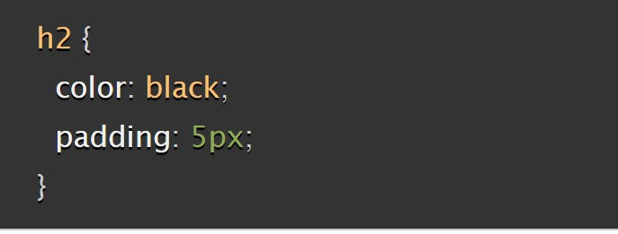

# Reading Notes 02

## Introduction of HTML

1.Why is it important to use semantic elements in our HTML?

> using semantic HTML elements is crucial for creating accessible, search engine-friendly, maintainable, and future-proof web content. It enhances the overall user experience and simplifies web development and maintenance.- Source-ChatGPT

2.How many levels of headings are there in HTML?

> There are six heading elements: h1, h2, h3, h4, h5, and h6. Each element represents a different level of content in the document; `<h1>` represents the main heading, `<h2>` represents subheadings, `<h3>` represents sub-subheadings, and so on.
*Source-*[HTML test fundamentals](https://developer.mozilla.org/en-US/docs/Learn/HTML/Introduction_to_HTML/HTML_text_fundamentals)

3.What are some uses for the `` and `` elements?

> The `` and `` elements in HTML are used to control the vertical alignment of text and typically involve raising or lowering the text relative to the surrounding text.- Source-ChatGPT

4.When using the `<abbr>` element, what attribute must be added to provide the full expansion of the term?

> this is used to wrap around an abbreviation or acronym. When including either, provide a full expansion of the term in plain text on first use, along with the `<abbr>` to mark up the abbreviation. This provides a hint to user agents on how to announce/display the content while informing all users what the abbreviation means.
*Source*[Advance text formating](https://developer.mozilla.org/en-US/docs/Learn/HTML/Introduction_to_HTML/Advanced_text_formatting)

## Learn CSS

1.What are ways we can apply CSS to our HTML?

* External stylsheet,Internal Stylesheet and Inline style

2.Why should we avoid using inline styles?

> Inline style is the least efficient implementation of CSS for maintenance. One styling change might require multiple edits within a single web page. Second, inline CSS also mixes (CSS) presentational code with HTML and content, making everything more difficult to read and understand. Separating code and content makes maintenance easier for all who work on the website. *Source* [How CSS is structred](https://developer.mozilla.org/en-US/docs/Learn/CSS/First_steps/How_CSS_is_structured)

3.Review the block of code below and answer the following questions:

a.What is representing the selector?

* h2

b.Which components are the CSS declarations?

* color and padding

c.Which components are considered properties?

* black and 5px

## Lean JS

1.What data type is a sequence of text enclosed in single quote marks?

String

2.List 4 types of JavaScript operators.

* Arithmetic Operators

* Comparison Operators

* Logical Operators

* Assignment Operators

3.Describe a real world Problem you could solve with a Function.

You can creat function to multiply 2 numbers. Assign a function name and add the parameters.

## Making decisions in your code — conditionals

An if statement checks a condition and if it evaluates to True, then the code block will execute.

2.What is the use of an else if?

> when the original "if" condition is false. It allows you to create a chain of conditional statements, where multiple conditions can be evaluated in sequence, and only the code block associated with the first true condition is executed. If none of the conditions are true, you can also provide a final "else" block to execute code when none of the conditions match. Source Chat GPT

3.List 3 different types of comparison operators.

> * === and !== — test if one value is identical to, or not identical to, another.
< and > — test if one value is less than or greater than another.
<= and >= — test if one value is less than or equal to, or greater than or equal to, another. Source [Making decisions in your code — conditionals](https://developer.mozilla.org/en-US/docs/Learn/JavaScript/Building_blocks/conditionals)

4.What is the difference between the logical operator && and ||?

> && — AND; allows you to chain together two or more expressions so that all of them have to individually evaluate to true for the whole expression to return true.
|| — OR; allows you to chain together two or more expressions so that one or more of them have to individually evaluate to true for the whole expression to return true. Source [Making decisions in your code — conditionals](https://developer.mozilla.org/en-US/docs/Learn/JavaScript/Building_blocks/conditionals)

## Things I want to know more about
