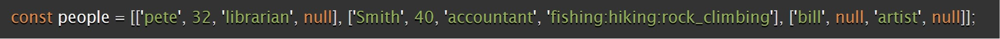
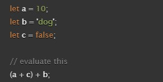

# Reading Notes Class 3

## Learn HTML

Why it's important????

1.When should you use an unordered list in your HTML document?

> grouping a collection of items that do not have a numerical ordering, and their order in the list is meaningless. Source [The Unordered List element](https://developer.mozilla.org/en-US/docs/Web/HTML/Element/ol)

2.How do you change the bullet style of unordered list items?

* list-style-type property

3.When should you use an ordered list vs an unorder list in your HTML document?

* If you have group of items that need to be in sequential you use ordered list . If not you can use the unorder list.

4.Describe two ways you can change the numbers on list items provided by an ordered list?

* Change the Start Number and change the Number Style:

## Learn CSS

1.Describe the CSS properties of margin and padding as characters in a story. What is their role in a story titled: “The Box Model”?

Padding will be on the inside of the box and your margin will be on the outside.

2.List and describe the four parts of an HTML elements box as referred to by the box model.

* Content box: The area where your content is displayed; size it using properties like inline-size and block-size or width and height.
* Padding box: The padding sits around the content as white space; size it using padding and related properties.
* Border box: The border box wraps the content and any padding; size it using border and related properties.
* Margin box: The margin is the outermost layer, wrapping the content, padding, and border as whitespace between this box and other elements; size it using margin and related properties.
Source[The box model](https://developer.mozilla.org/en-US/docs/Learn/CSS/Building_blocks/The_box_model)

## Learn JS

1.What data types can you store inside of an Array?

* strings, numbers, objects, and even other arrays

2.Is the people array a valid JavaScript array? If so, how can I access the values stored? If not, why?

Yes Its is Vaid. You can access specific values within the inner arrays by providing both the index of the outer array (for the person) and the index of the inner array (for the specific attribute or field you want to access).

3.List five shorthand operators for assignment in javascript and describe what they do.

| Shothand   |  | Meaning     |
|:------:    |---: |:------------|
| x += y |   | x = x + y     |
| x -= y  |   | x = x - y     |
| x *= y  |   | x = x * y     |
| x /= y    |   | x = x / y     |
| x %= y  |   | x = x % y     |

4.Read the code below and evaluate the last expression and explain what the result would be and why.

(a + c) is evaluated first:
A is a number plus C is false (boolean) which will be zero if we add to the 10. now we have to add the string (dog) which will be equal to 10dog.

5.Describe a real world example of when a conditional statement should be used in a JavaScript program.

The website might offer free shipping for orders above a certain amount. A conditional statement is used to check the total cart value and, if it exceeds the threshold, apply free shipping.

6.Give an example of when a Loop is useful in JavaScript.

printing the number from 1-100. You don't need to write 100 instead write a for loop that will write it for you like this

-------------------------------------------------
`for (let i = 1; i <= 100; i++) {
  console.log(i);
}`
------------------------------------------------

## Things I want to know more about

Describe two ways you can change the numbers on list items provided by an ordered list?

how to access the values of the inner array.
